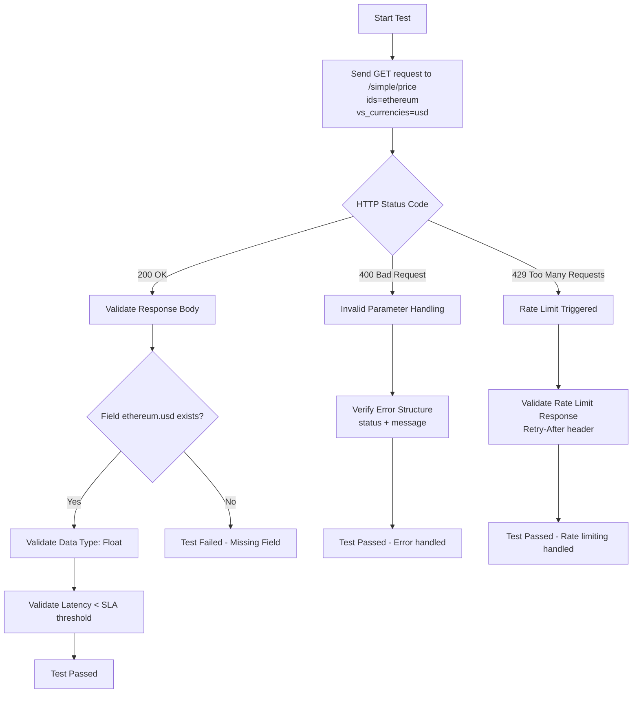

Objetivo del Test

Validar la integridad del dato numérico del precio de Ethereum en USD y verificar que la latencia de respuesta del endpoint financiero cumpla con el SLA definido.

| ID | Escenario de Prueba | Prioridad | Resultado Esperado |
|---|---|---|---|
| TC-01 | Validación de Status Code 200 | Alta | La API debe retornar 200 OK para parámetros válidos (ethereum, usd). |
| TC-02 | Integridad del Esquema JSON | Alta | La respuesta debe contener el campo ethereum y el sub-campo usd. |
| TC-03 | Validación de Tipos de Datos | Media | El valor del precio (usd) debe ser de tipo Float o Number. |
| TC-04 | Verificación de SLA (Latencia) | Media | El tiempo de respuesta debe ser inferior a 500ms (definido como SLA crítico). |
| TC-05 | Manejo de Parámetros Inválidos | Alta | Al enviar un ID inexistente, la API debe manejar el error sin romper el contrato. |
| TC-06 | Validación de Rate Limiting (429) | Media | Si se excede el límite de requests, validar que retorne 429 y el encabezado Retry-After. |

Análisis de Resultados (SLA)

Resultado general: Todas las pruebas se ejecutaron correctamente y pasaron, con excepción del TC-04.

Nota: El TC-04 falló durante la ejecución (ver reporte HTML) debido a latencias de la API pública superiores al umbral definido en el SLA. Este resultado puede estar influenciado por factores externos del servicio público (por ejemplo, carga del servidor o variaciones de red), por lo que no necesariamente indica un defecto funcional en el endpoint.
