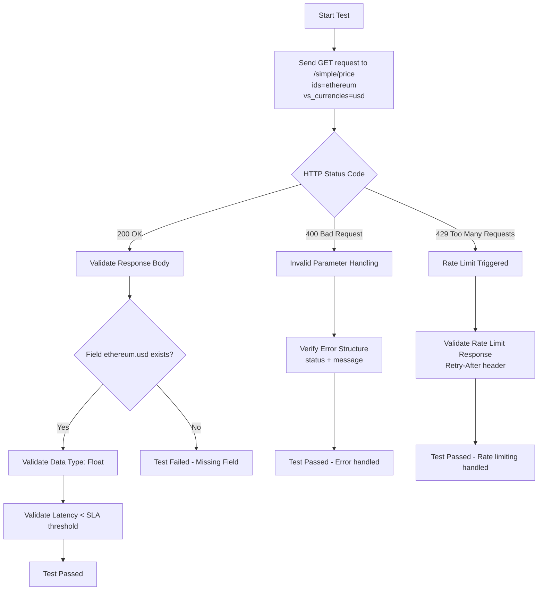

```mermaid
flowchart TD

A[Start Test] --> B[Send GET request to /simple/price
ids=ethereum
vs_currencies=usd]

B --> C{HTTP Status Code}

C -->|200 OK| D[Validate Response Body]

D --> E{Field ethereum.usd exists?}

E -->|Yes| F[Validate Data Type: Float]

F --> G[Validate Latency < SLA threshold]

G --> H[Test Passed]

E -->|No| I[Test Failed - Missing Field]

C -->|400 Bad Request| J[Invalid Parameter Handling]

J --> K[Verify Error Structure
status + message]

K --> L[Test Passed - Error handled]

C -->|429 Too Many Requests| M[Rate Limit Triggered]

M --> N[Validate Rate Limit Response
Retry-After header]

N --> O[Test Passed - Rate limiting handled]
```
