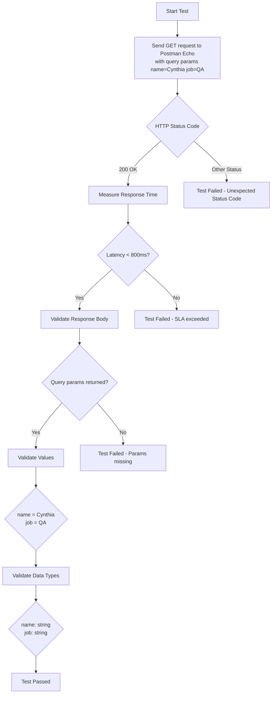

Objetivo del Test

Validar que el endpoint de Postman Echo procese correctamente los parámetros de consulta (query params), verificando el status code, el tiempo de respuesta, la integridad de los datos retornados y la correcta tipificación de los valores recibidos.

| ID    | Escenario de Prueba                  | Prioridad | Resultado Esperado                                                  |
| ----- | ------------------------------------ | --------- | ------------------------------------------------------------------- |
| TC-01 | Validación de Status Code            | Alta      | El endpoint debe retornar **HTTP 200 OK** para una request válida.  |
| TC-02 | Verificación de SLA (Latencia)       | Media     | El tiempo de respuesta debe ser **menor a 800 ms**.                 |
| TC-03 | Validación de Parámetros de Consulta | Alta      | La respuesta debe contener `args.name = Cynthia` y `args.job = QA`. |
| TC-04 | Validación de Tipos de Datos         | Media     | Los valores `name` y `job` deben ser de tipo **string**.            |

Análisis de Resultados (SLA)

Resultado general: Durante la ejecución del test set (ver reporte HTML de Newman), todas las solicitudes y aserciones fallaron.

Nota: El reporte indica 4 requests ejecutadas y 5 assertions fallidas, con un tiempo de respuesta promedio registrado de 0 ms, lo cual sugiere que las requests no recibieron respuesta válida del endpoint o hubo un problema de conectividad durante la ejecución.

Como consecuencia, las validaciones de status code, latencia, parámetros de consulta y tipos de datos no pudieron completarse correctamente.
